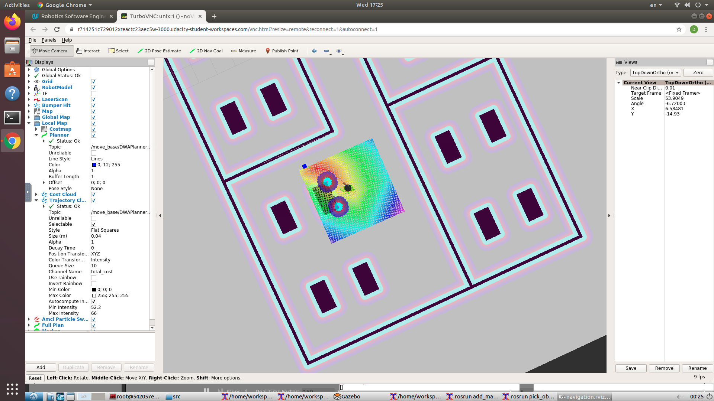

# Home Service Robot

## Project Goals

The goals of this project are:
- simulating a full home service robot capable of navigating to pick up and deliver virtual objects
- interfacing the robot with different ROS packages
- SLAM, localization, and navigation testing
- Reaching multiple goals and modeling virtual objects

## Files
    ├──                                # Official ROS packages
    |
    ├── slam_gmapping                  # gmapping_demo.launch file                   
    │   ├── gmapping
    │   ├── ...
    ├── turtlebot                      # keyboard_teleop.launch file
    │   ├── turtlebot_teleop
    │   ├── ...
    ├── turtlebot_interactions         # view_navigation.launch file      
    │   ├── turtlebot_rviz_launchers
    │   ├── ...
    ├── turtlebot_simulator            # turtlebot_world.launch file 
    │   ├── turtlebot_gazebo
    │   ├── ...
    ├──                                # Your packages and direcotries
    |
    ├── map                          # map files
    │   ├── ...
    ├── scripts                   # shell scripts files
    │   ├── ...
    ├──rvizConfig                      # rviz configuration files
    │   ├── ...
    ├──pick_objects                    # pick_objects C++ node
    │   ├── src/pick_objects.cpp
    │   ├── ...
    ├──add_markers                     # add_marker C++ node
    │   ├── src/add_markers.cpp
    │   ├── ...
    └──
## Build and Launch

Execute the following commands to set it up for the project:
```sh
$ mkdir -p ~/catkin_ws/src
$ cd ~/catkin_ws/src
$ catkin_init_workspace
$ cd ..
$ catkin_make
$ sudo apt-get update
$ cd ~/catkin_ws/src
$ git clone https://github.com/ros-perception/slam_gmapping
$ git clone https://github.com/turtlebot/turtlebot
$ git clone https://github.com/turtlebot/turtlebot_interactions
$ git clone https://github.com/turtlebot/turtlebot_simulator
$ cd ~/catkin_ws/
$ source devel/setup.bash
$ rosdep -i install gmapping
$ rosdep -i install turtlebot_teleop
$ rosdep -i install turtlebot_rviz_launchers
$ rosdep -i install turtlebot_gazebo
$ catkin_make
$ source devel/setup.bash
```

### SLAM Testing

Run `test_slam.sh` in `scripts`. It will deploy a turtlebot inside the Gazebo environment, control it with keyboard commands, interface it with a SLAM package, and visualize the map in rviz.

### Localization and Navigation Testing

Run `test_navigation.sh` in `scripts`. Once launching all the nodes, you will initially see the particles around the robot, which means that AMCL recognizes the initial robot pose. Manually point out to different goals and direct your robot to reach them and orient itself with respect to them.

### Reaching Multiple Goals

Run `pick_objects.sh` in `scripts`. The robot has to travel to the desired pickup zone, display a message that it reached its destination, wait 5 seconds, travel to the desired drop off zone, and display a message that it reached the drop off zone.

### Modeling Virtual Objects

Run `add_markers.sh` in `scripts`. The virtual object is the one being picked and delivered by the robot, thus it should first appear in its pickup zone, and then in its drop off zone once the robot reaches it. 

## Home Service Robot: Final Results

 The full home service robot is simulated to be capable of navigating to pick up and deliver virtual objects. To achieve this goal, the `add_makers` node and the `pick_object` node should communicate with each other. Thus, I build a rostopic `/robot_status` to build the connection.

The image below shows the robot in the middle of picking the objects.



A video showing the whole pickup and dropoff task has been uploaded to https://youtu.be/-lB9FcFdcjs.